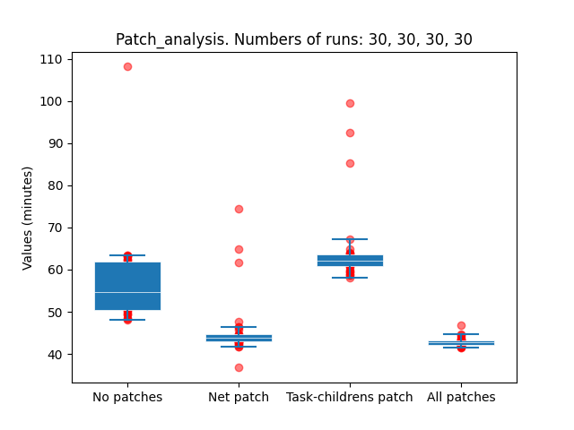
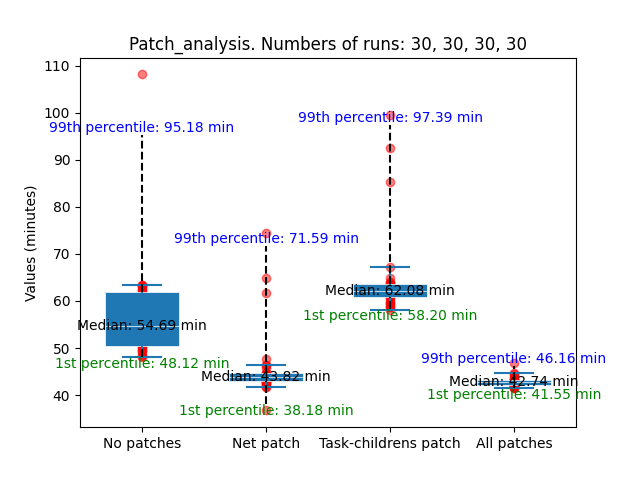

# box_plot.py
Python скрипт для построения графиков по результатам эксперимента с патчами (speeding_up)

## Описание
Скрипт предназначен для построения графиков на основе результатов эксперимента с патчами (speeding_up). Он читает данные из текстовых файлов, содержащих результаты экспериментов, и строит графики.

## Как запустить программу?
Для того, чтобы настроить поведение программы, реализован командный интерфейс:

```bash
options:
  -h, --help            show this help message and exit
  --file_path_no_pathes FILE_PATH_NO_PATHES
                        Enter the path to the file
  --file_path_net_patch FILE_PATH_NET_PATCH
                        Enter the path to the file
  --file_path_childrens_patch FILE_PATH_CHILDRENS_PATCH
                        Enter the path to the file
  --file_path_all_patches FILE_PATH_ALL_PATCHES
                        Enter the path to the file
  --plot_name PLOT_NAME
                        Enter title of plot
  --save, --no-save     Save the plot (default: True)
  --show, --no-show     Show the plot (default: True)
  --standard_boxplot, --no-standard_boxplot
                      Use standard box plot (default: False)
```


### Аргументы
- `file_path_no_pathes`, `file_path_net_patch`, `file_path_childrens_patch`, `file_path_all_patches`: аргументы, помогающие указать пути к текстовым файлам - результатам работы эксперимента сборки `core-image-minimal` без патчей, с патчем балансировки нагрузки на сети, патчем, меняющим приоритет задач, и с обоими патчами соответственно. По умолчанию скрипт ожидает, что в дочерней (относительно расположения скрипта) директории `speeding_up_results` расположены файлы `time1.txt`, `time2.txt`, `time3.txt`, `time4.txt`.
- `plot_name`: имя, которое используется в заголовке графика и под которым он сохраняется в формате PNG. По умолчанию устанавливается `Patch_analysis`.
- `save` и `show`: значения, настраивающие поведение программы - показывать или не показывать, сохранять или не сохранять полученные графики. По умолчанию график показывается и сохраняется.
- `standard_boxplot`: флаг, который можно указать, чтобы убрать все кастомизации, оставив только стандартный `boxplot` и отрисовку значений красными точками.

## Как читать графики?
- По оси ординат указано время выполнения эксперимента (в минутах).
- По оси абсцисс указано, какой эксперимент проводился (без патчей, с патчем балансировки нагрузки на сети, с патчем, меняющим приоритет задач, и с обоими патчами).

### Легенда
- **Синим "ящиком"** обозначены значения, которые находятся между 25-м и 75-м процентилями.
- **Синими горизонтальными линиями (усиками)** обозначены значения, которые находятся в пределах 1.5 межквартильного размаха от квартилей. Эти линии заканчиваются синими полосами.
- **Черными пунктирными линиями** обозначены 1-й и 99-й процентили.
- **Красными точками** обозначены значения из диапазона [1-й процентиль, 25-й процентиль] и [75-й процентиль, 99-й процентиль].
- Внутри синего ящика черным цветом подписано значение медианы.
- Зеленым и синим текстом подписаны 1 и 99 процентили соответственно.

## Как получить данные?
Необходимо провести эксперимент `speeding_up_experiment` (src/common/scripts/speeding_up_experiment.sh) с разным набором патчей. Рекомендуется указывать значение повторений больше 10 (в текущем варианте указываем 30).

Эксперимент сохраняет результаты сборок и затраченное время в папку `src/buildstats_saves`. В ней находится файл `time.txt`, который и используется для построения графиков.


## Результат работы скрипта 

### Результат работы с флагом --standard_boxplot




### Результат работы без флага --standard_boxplot

